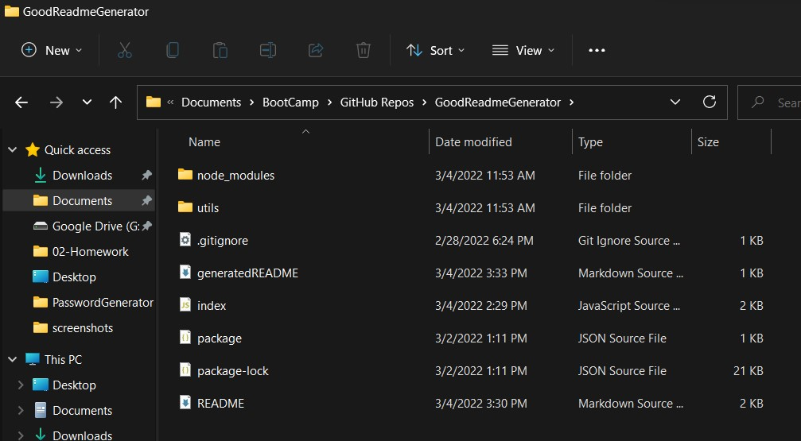
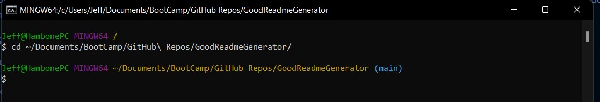
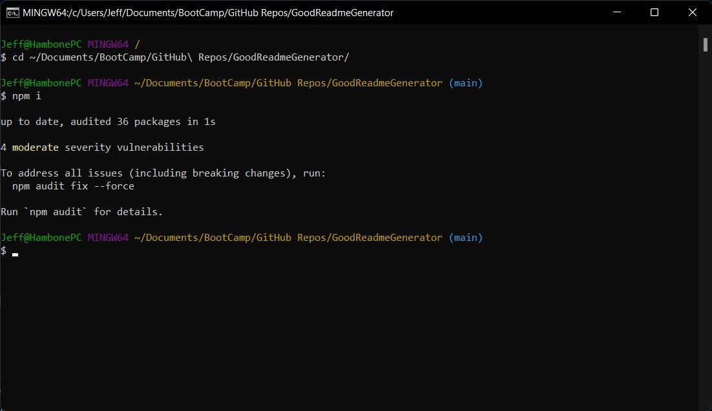
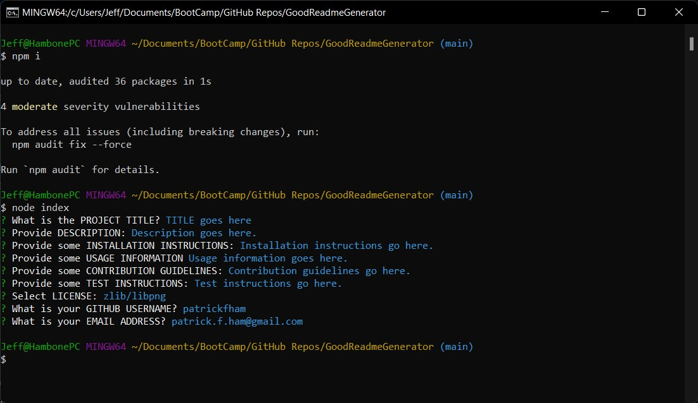

# GoodReadmeGenerator
(no deployed site, a video is linked below to show it working)

## Description
README files should be professional, BUT they should be easy to make, too!  This 'Good README Generator' makes what usually is super-annoying more pleasant.  It even does the dirty-work of finding a license badge and link for you!

## Usage Instructions
- Copy these files (including the folder "utils", and the file structure) into a known place on your local drive.

- Open a terminal in that known local directory location.

- Double-check to make sure that your terminal is resting in the folder of the index.js file.

- Use the command "npm i" (without the quotation marks) to ensure the required packages are installed.

- Use the command "node index" (without the quotation marks) to run the program.

- Follow the prompts in the terminal.  When the process is done, you'll be returned to the command prompt.
- A newly-generated file in that folder will be created:  "generatedREADME.md" 
- You can copy this new file into another folder and rename it "README.md".

## Screenshots
(video demo below instead of screenshots)

## Video Demos
Full Demo (including scalability) here: https://drive.google.com/file/d/1ESnBczb3hAhB0ofh-wPQMBbyw-bPBMdf/view
